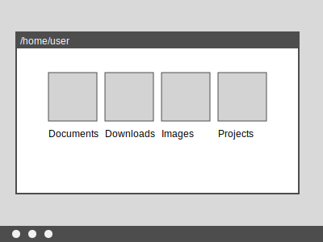

= Bash
:source-highlighter: highlight.js
== Introduction
=== What is Bash?
_Bash_ is a _command line interface_ (CLI) to Linux and many other operating systems. Unless a _graphical user interface_ (GUI) is started with lots of pretty windows that move around, Bash will probably be what is seen after logging into a Linux computer. So, after entering a correct username and password, what will be seen is something like this with no indication of what to do next.

`$_`

If a GUI is started, then Bash can be started in a window of the GUI but the specific method varies among Linux systems.

Bash vs. a GUI

++++

++++

[source,bash]
----
$ pwd
/home/user
$ ls
Documents  Downloads  Music  Pictures  Projects
$ cd Projects
$ ls
my_project
$ cd my_project
$ ls
data.txt  notes.txt  script.sh
$ cat notes.txt
Meeting notes:
- Discuss project timeline
- Review initial requirements
$ grep "timeline" notes.txt
- Discuss project timeline
$ echo "TODO: Add more data analysis steps" >> notes.txt
----

++++

++++

++++

++++

=== Why use Bash?

One may wonder why a CLI like Bash is worth learning when an easy learned and used GUI is available. The answer is,

* CLIs make certain types of tasks easier
* Some tasks cannot be done without Bash because a GUI equivalent is unavailable.
* Tasks can easily be automated with Bash but GUI automation is difficult.
* Typing is faster than using the mouse for most tasks.

Examples of these situations will be demonstrated through the course.

A distinguishing trait of advanced Linux users is knowing how to use Bash.

== The Linux filesystem
=== Directories, files, and data
Although not specific to Bash, understanding how Linux stores data is necessary to use Bash.

A _filesystem_ is how computers store data on permanent storage devices such as disk drives. Filesystems contain primarily two types of items, known as _objects_: _directories_ and _files_.

_Files_ contain data. A file can contain any type of computer data. Examples include a text document, a music track, or software program. Files cannot contain other files.

_Directories_ are an organization tool. Directories contain files and other directories but cannot directly contain data like files can.

The relationship of directories, files, and data. Arrows represent containership.

[graphviz, format="svg"]
....
digraph g {
  files -> data
  directories -> files
  directories -> directories
}
....

=== Filesystems

Comparing a filesystem to a tree, directories are tree branches and files are leaves. Leaves (files) can grow anywhere, including the tree trunk.

At the top of the tree is the _root directory_ which corresponds to a tree trunk. There can be only one root directory and it is named "/", which is the character _frontslash_ ("\" is a "backslash").

An example filesystem. Arrows represent containership.

[graphviz, format="svg"]
....
digraph g {
  "/" -> dir1
  "/" -> dir2
  "/" -> file1
  "/" -> file2
  dir1 -> file4
  dir1 -> file5
  dir1 -> dir4 -> file9
  dir1 -> dir5 -> file10
  dir2 -> dir6 -> file11
  dir2 -> dir7 -> file12
  dir2 -> file8
}
....

In this simple filesystem, the root directory contains two directories and two files. Each of those two directories also contain directories and files. There is no practical limit to the number of directories and files a directory can contain, nor is there a practical limit to how deep directories can branch to other directories.

=== Filesystem object naming

Each filesystem object has a name associated with it.

[graphviz, format="svg"]
....
digraph g {
  "/" -> bob
  "/" -> sue
  "/" -> "annual.report.q1.txt"
  "/" -> "annual.report.q2.txt"
  bob -> "holiday.party.txt"
  bob -> "corporate.retreat.mp4"
  sue -> "accounts.payable.txt"
}
....

In this example, the root directory contains directories for "bob" and "sue" and two files. "bob" contains two files and "sue" contains one file.

=== Filesystem paths

We can address any object on a filesystem using a _path_.

[graphviz, format="svg"]
....
digraph g {
  "/" [style=filled, fillcolor=lightblue]
  bob [style=filled, fillcolor=lightblue]
  "holiday.party.txt" [style=filled, fillcolor=lightblue]
  "/" -> bob
  "/" -> sue
  "/" -> "annual.report.q1.txt"
  "/" -> "annual.report.q2.txt"
  bob -> "holiday.party.txt"
  bob -> "corporate.retreat.mp4"
  sue -> "accounts.payable.txt"
}
....

The directories necessary to address any file or directory in a file path are separated by "/".

The path to "holiday.party.txt" is "/bob/holiday.party.txt".

Every object on the filesystem can be addressed this way.

=== A different view of directory contents

Up to now, directory contents have been presented graphically:

[graphviz, format="svg"]
....
digraph g {
  "/" -> bob
  "/" -> sue
  "/" -> amy
  "/" -> "annual.report.q1.txt"
  bob -> "holiday.party.txt"
  sue -> "accounts.payable.txt"
}
....

From now on, directory contents will be presented textually, which is how you would see them when using Bash. The root directory is omitted.

[source]
----
annual.report.q1.txt
annual.report.q2.txt
bob
  holiday.party.txt
sue
  accounts.payable.txt
amy/
----

`amy` is an empty directory that contains no objects. To distinguish empty directories from files, empty directories have a frontslash after them.

This can refer to any directory contents, not just the root directory. For example, this listing could be the contents of `/human.resources/employees/`

=== File paths: ending frontslashes

An ending "/" distinguishes if the final item in a directory path is a file or a directory. So,

`monthly.reports/` is a directory

`monthly.reports` is a file.

The ending frontslash is often omitted depending on situations which we will explore.

=== File paths: file extensions

By convention, a file ends with a short identifier, called a _file extension_ indicating the type of file, but it's not a requirement.

`annual.report.q1.txt` is a text file.

`corporate.retreat.mp4` is an mp4 video file.

Hundreds of standard file extensions exist. You will learn more file extensions as you learn Bash.

=== Directory contents must have unique names

Within a single directory, no two objects can have the same name. So within `/bob/` there cannot be any file or directory with the same name as another file or directory in `/bob/`. Two objects in the filesystem may be named identically but they must be in different directories.

This cannot occur.

[source, bash]
----
/bob/test.txt
/bob/test.txt
----

However this is fine.

[source, bash]
----
/bob/test.txt
/sue/test.txt
----

Beyond their role in organization, directories prevent name conflicts.

== Beginning Bash
=== Current working directories

Every Bash session has an associated _current working directory_ (CWD). Think of the CWD as your current location on the filesystem.

[source, bash]
----
annual.report.q1.txt
annual.report.q2.txt
bob
  holiday.party.txt
  corporate.retreat.mp4
sue
  accounts.payable.txt
----

The contents of the CWD can be addressed without using complete file paths. If our CWD is "bob" then we can address "holiday.party.txt" without preceding with "/bob/".

=== Home directories

When starting Bash, your CWD is normally the _home directory_ of the user you logged in as. Unless configured otherwise, the home directory follows the pattern

`/home/<username>`

So if you are logged in under "bob", your home directory, and where Bash starts, will be

`/home/bob/`

=== Bash interface

The most common way to interact with Bash is by typing _commands_.

Typically the Bash interface looks something like this (although it can be configured to look much different)

`$`

That is called the _prompt_ and where commands can be typed in. The prompt is automatically displayed immediately after initiating a Bash session.

=== Printing to the screen: `echo`

Our first Bash command will simply print something to the screen. Anything after the prompt (`$`) is content you would type.

[source, bash]
----
$ echo "Hello World!"
Hello World!
----

Always press the `ENTER` (or on some systems `RETURN`) key after finishing typing a command to execute it.

`echo`: display a line of text

=== Listing directory contents: `ls`

Let's assume a Bash session is freshly started. CWD is the user home directory and a Bash prompt is seen.

`$`

We can see the contents of the home directory with the `ls` command.

`$ ls`

The output will vary between different Linux systems.

=== Creating a new directory: `mkdir`

Let's create a new directory for our work to keep it segregated. We will create a new directory called `bash-tutorial` using the `mkdir` command.

`$ mkdir bash-tutorial`

We can now use the `ls` command and see our new directory. The rest of the home directory contents will also be printed.

[source, bash]
----
$ ls
bash-tutorial
----

=== changing the CWD: `cd`

We created our new directory and want to switch to it so we can avoid typing paths. We use `cd` (change directory):

[source, bash]
----
$ cd bash-tutorial
----

`ls` will show it empty.

[source, bash]
----
$ ls
----

=== Seeing the path of the CWD: `pwd`

In case we forget, the path of the CWD can be printed with `pwd`.

[source, bash]
----
$ pwd
/home/bob/bash-tutorial/
----

=== Creating a file: `>`

Bash features _output redirection_ to send the output of a command to a file. The pattern of redirection is *always*

<command> <redirection operator> <file>

Earlier we used the `echo` command to print a message to the screen. This time we will use output redirection to instead create a file to contain the output of `echo`.

[source, bash]
----
$ echo "this is a line" > test.txt
----

This command both created a new file and added content to it.

[source, bash]
----
$ ls
test.txt
----
=== The meaning of "command"

The use of "command" has been used in different ways.

* A command as in `echo` (a basic command)
* A command as in `echo test.txt` (a command with arguments)
* A command as in `echo test.txr > test.txt` (everything typed before pressing ENTER)

All three of these are correct. While it may seem a problem, in practice which of the three meanings of "command" is intended is understood from context.

=== Viewing file contents: `cat`
Print the contents with the `cat` command

[source, bash]
----
$ echo "this is a line" > test.txt
$ cat test.txt
this is a line
----

=== Adding more lines: `>>`
The redirector used earlier `>`, always overwrites any existing file content.

[source, bash]
----
$ echo "this is a line" > test.txt
$ cat test.txt
this is a line
$ echo "first line" > test.txt
$ cat test.txt
first line
----

"this is a line" was overwritten.

Instead of overwriting, add a second line using _append redirection_ (`>>`).

[source, bash]
----
$ echo "second line" >> test.txt
$ cat test.txt
first line
second line
----

Like the output redirector, the file will be created if it doesn't exist, so to prevent data loss, we will usually prefer append redirection to output redirection.

=== Copying files: `cp`
`cp` copies filesystem objects.

[source, bash]
----
$ cp test.txt sample.txt
$ ls
test.txt sample.txt
----

`cp` cannot copy directories this way. We will look at directory copying later.

=== Renaming files: `mv`
`mv` renames and moves filesystem objects.

[source, bash]
----
$ mkdir /home/bob/
$ echo "first line" > test.txt
$ mv test.txt test0.txt
test.txt test0.txt
----

`mv` is an abbreviation of "move". Why "move" instead of "rename"?

Think of `mv` as using the entire file path:

`/home/bob/test0.txt`

The data was previously available at

`/home/bob/test.txt`

So, test.txt was renamed by moving it to another path.

We are not moving data, but rather moving the data to another path.

=== Moving files: `mv`

If we want to move the file to the home directory we can use `mv` also

[source, bash]
----
$ mkdir /home/bob/
$ echo "first line" > test.txt
mv test.txt /home/
ls /home/
test.txt
----

With `mv`, we're changing the path to a file or directory; "moving to a new address".

== Command arguments
=== Command arguments introduction
We've seen several cases where a command was used with some additional information:

* cd `bash-tutorial`
* cp `test.txt sample.txt`
* echo `"this is a line"`
* mkdir `/home/bob/`
* mv `test.txt test0.txt`

Instances of that additional information are called _arguments_. The arguments we've seen so far are _positional arguments_ and are the simplest type of arguments. The meanings of positional arguments are understood based on their location in the arguments. For example, with `mv`,

`mv test.txt test0.txt`

the first positional argument is always the existing file object and the second positional argument is always the new location. They cannot be reversed.

Redirectors (`>`, `>>`) are not arguments.

=== Options

An _option_ is an argument of one letter preceded by a dash "-". An example of using an option is `-1` used with `ls`. `-1` (one-column) instructs `ls` to list directory contents vertically.

[source,bash]
----
company_brand_book.pdf
logo_guidelines.pdf
----

[source,bash]
----
$ cd marketing
$ ls -1
company_brand_book.pdf
logo_guidelines.pdf
----

without `-1`, `ls` prints horizontally.

[source,bash]
----
$ cd marketing
$ ls
company_brand_book.pdf logo_guidelines.pdf
----

Unlike positional arguments, the meaning of options aren't understood from their location, so they can appear in any order where they are allowed. The meaning of this will become clear later.

=== Using multiple options

The `-r` argument of `ls` reverses the normal alphabetical order of the output.

[source,bash]
----
company_brand_book.pdf
logo_guidelines.pdf
----

[source,bash]
----
$ ls
company_brand_book.pdf logo_guidelines.pdf
$ ls -r
logo_guidelines.pdf company_brand_book.pdf
----

To print the contents of `branding` as one column in reverse, we use `-1` and `-r`.

[source,bash]
----
$ cd branding
$ ls -r -1
logo_guidelines.pdf
company_brand_book.pdf
----

=== Options can appear in any order

Options, unlike positional arguments, may occur in any order where they are allowed, so `-1 -r` works just like `-r -1`.

[source,bash]
----
company_brand_book.pdf
logo_guidelines.pdf
----

[source,bash]
----
$ ls -r -1
logo_guidelines.pdf
company_brand_book.pdf
$ ls -1 -r
logo_guidelines.pdf
company_brand_book.pdf
----

=== Combining options
[source,bash]
----
company_brand_book.pdf
logo_guidelines.pdf
----
As a shortcut, options can be bundled together, or _combined_.
[source,bash]
----
$ ls -1r
logo_guidelines.pdf
company_brand_book.pdf
----
=== Using options with positional arguments
[source,bash]
----
marketing
  campaigns
    Q1_product_launch.pdf
    summer_promo_plan.pdf
  branding
    logo_guidelines.pdf
    company_brand_book.pdf
----
When CWD is `marketing/campaigns`, list the contents of /marketing/branding/ in a reversed single column.
[source,bash]
----
$ cd marketing/campaigns
$ ls -1r marketing/branding
logo_guidelines.pdf
company_brand_book.pdf
----
Because `marketing/branding` is a positional argument,

`ls marketing/branding -1r`

is invalid.

Most commands have a specified area where options can occur. Within that area options can be in any order.

=== How Linux views arguments

Consider the following command

`ls -r -l /home/bob`

Linux imposes no structure on arguments nor attempts to understand them. Linux converts everything after the command to a list and sends the list to the command and the command itself is responsible processing arguments. So, at program start, `ls` will receive something like this

["-r", "-l", "/home/bob/"]

Understanding and processing arguments is the responsibility of the command. Linux plays no part in it. Attempting to standardize, most Linux commands follow a certain pattern for their arguments, but some Linux commands are rogue and don't follow typical patterns.

== Deleting filesystem objects
=== Deleting a single file: `rm`
[source, bash]
----

sales_report_Jan.csv
sales_forecast_Q1.pdf
----
`rm` removes a file.

[source, bash]
----
$ rm sales_forecast_Q1.pdf
$ ls
sales_report_Jan.csv
----

=== Deleting an empty directory: `rmdir`
[source, bash]
----
client_contact
  client_list.csv
sales_reports/
----
`rmdir` removes empty directories
[source, bash]
----
$ rmdir sales_reports
$ ls
client_contact
----
If we try to delete a directory containing objects we get an error.
[source, bash]
----
$ rmdir client_contact
----
rmdir: failed to remove 'client_contact': Directory not empty

=== Deleting a directory tree: `rm -rf`
`rm` provides a powerful option set to remove a directory and its contents but be careful using it. Its easy to make a mistake and delete important data.

[source, bash]
----
sales
  client_contact
    client_list.csv
----
[source, bash]
----
$ rm -rf sales
$ ls sales
ls: cannot access 'sales': No such file or directory
----

`-r`: _recursive_: a fancy way of saying the command will search the entire directory tree
`-f`: _force_: without this option, `rm` will prompt before deleting every file

The most dangerous command possible is `rm -rf /`. This will delete everything in your filesystem and crash Linux. All data will be lost and Linux will require re-installation.

== More commands with options
=== Our current command list
So far, we have introduced these commands.

* echo
* cd
* cp
* mkdir
* ls
* pwd
* mv
* cat
* rm
* rmdir

In addition, we introduced these options:

* ls: -r, -1,
* rm: -r, -f

In this section we will explore useful options for many of these commands.

=== Copying directory trees: `cp -a`
[source, bash]
----
sales
  client_contact
    client_list.csv
----

A quick form of backup is copying a directory and all its contents. Let's copy client_contact to another directory in `sales`.

[source, bash]
----
cd sales
cp -a client_contact client_contact_backup
ls
client_contact client_contact_backup
----

`cp -a` copy complete directory trees

=== Numbering lines: `cat -n`
=== Create complete paths: `mkdir -p`
=== List extended object information: `ls -l`
=== List object information recursively: `ls -R`
=== List objects sorted by time: `ls -t`
=== Do not overwrite existing file on copy: `cp -n`
== Option arguments
=== Two meanings of "argument"

Like "command", "argument" has multiple meanings.

In `ls -a -l /home/bob`

=== Anatomy of a command 3

The presence of option arguments and combined options raises a question. Can all this be combined?

`-a arg -def`

The answer is 'yes', but there's some rules. Combining these would look like

`-defa arg`

The rules combining options are:

. Only one option requiring an argument may be used
. The option requiring an argument must be last

There is no way to further combine (arg1 is an argument to option e)

`-dfe arg1 -a arg2`

=== A command with multiple options and parameters

Given this directory structure

[source]
----
sales
  client_contact
    client_list.csv
  sales_reports
    sales_report_Jan.csv
    sales_forecast_Q1.pdf
----

[source, bash]
----
cd /sales_reports/
ls -1
sales_report_Jan.csv
sales_forecast_Q1.pdf
----

`-1` is an _option_ to display directory entries in a single column.

=== Options are of two types

* Short options are one letter preceded by dash
* long options are multiple letters and preceded by two dashes

Short options can usually be combined, such as

ls -(something)

in this case, only the final option can be passed a parameter.

Note that Bash commands aren't always consistent in the way they use options and parameters. some allow long options, some don't.

== Globbing

=== Absolute vs relative paths
So far, if we wanted to address a directory or a file in a directory that is not CWD, we typed out the entire path

/home/bob/bash-tutorial/test.txt

This is called an _absolute path_. Absolute paths are always from the perspective of the root directory.

Typing put all those paths is a chore. As a shortcut, Bash offers _relative paths_ which are from the perspective of the CWD. The reason in previous examples we didn't need to add paths when working with the contents of home/bon/bash-tutorial is because we were using relative paths.

Lets make bash-tut our current directory, create a directory in it, and create a file.

cd bash-tutorial
mkdir lesson1
cd lesson1

In all three cases we used relative paths. Using absolute paths would require

mkdir /home/bob/bash-tutorial/lesson1
cd /home/bob/bash-tutorial/lesson1

=== . and ..

Notice when using `la -d`theres two extra entries

.
..

. refers to the current directory. we may use it in certain circumstances, such as executing a program EXAMPLES

.. refers to the parent directory. we can use it as a shortcut in relative paths

cd ..

CWD is now /home/bob/.

=== don't change CWD for short tasks
Most commands take a path parameter if you only need to perform pne task don't change CWD. Instead, pass a path parameter to the command, if the command takes it.

EXAMPLE

== Users and groups

As a multi-user operating system, Linux maintains strict permissions on who can access files. You wouldn't for example want another user accessing your files, which may contain private information or someone maliciously deletes your data. Every object in the filesystem has an associated set of permissions

* read
* write
* execute

That are repeated three times

* owner
* group
* world

combined, three are nine permissions

The big difference between files and directories when using these permissions is that "executing" a directory means making it the CWD, i.e., `cd`-ing into it.

=== groups

A group in Linux is a named set if users that are treated as a user. A group may contain users or groups

The owner of a file may be a user or a group.

The group of a file grants access to any group the owner is a member of.

World means anyone.

=== touch

Let's create a set of test files to play with permissions. The `touch` command updates the timestamp of a file to the current time and creates an empty file if it doesn't exist.

 touch file1 file2 file3

=== changing file permissions

 the `chmod` command changes the 000

== File commands
=== Determine file type: `file`
=== Paginate long output: `less`
=== Print lines that match patterns: `grep`
=== Change file timestamps: `touch`
=== Create empty files: `touch`
=== Create symbolic links: `ln`
=== Searching the filesystem: `find`
=== Estimate disk usage of a directory tree: `du`

== Process commands
=== Introduction
The commands we have used so far either run instantly or in a short amount of time. Some however take a long time to execute or are designed to never stop.

A command that is currently executing is called a _process_.

=== ps—Report a snapshot of current processes.
=== top—Display tasks.
=== jobs—List active jobs.
=== bg—Place a job in the background.
=== fg—Place a job in the foreground.
=== kill—Send a signal to a process.
=== killall—Kill processes by name.
=== shutdown—Shut down or reboot the system.

== Filesystem permissions
=== id—Display user identity.
=== chmod—Change a file's mode.
=== umask—Set the default file permissions.
=== su—Run a shell as another user.
=== sudo—Execute a command as another user.
=== chown—Change a file's owner.
=== chgrp—Change a file's group ownership.
=== passwd—Change a user's password

== Getting help
=== whatis-display one-line manual page descriptions
=== man-an interface to the system reference manuals

== Environment commands
=== Introduction

So far, we have discussed two methods to interact with Bash

* command
* hoykeys

A third method is environmental variables.

An environmental variables is a sequence of characters ket in memory and retrieved by a label.

VAR=myvariable

=== alias-define or display aliases
=== whoami-print effective userid
=== id-print real and effective user and group IDs
=== which-locate a command
=== whereis-locate the binary, source, and manual page files for a command
=== shopt
=== uname
=== pushd
=== popd
=== Environment variables
==== export-set export attribute for shell variables
==== env-run a program in a modified environment
==== PATH
==== CDPATH
==== PWD
==== USER

== Archiving and backup commands
=== gzip—Compress or expand files.
=== bzip2—A block sorting file compressor.
=== tar —Tape-archiving utility.
=== zip —Package and compress files.
=== rsync-a fast, versatile, remote (and local) file-copying tool

== Text processing commands
=== wc-print newline, word, and byte counts for each file
=== uniq-report or omit repeated lines
=== head-output the first part of files
=== tail-output the last part of files
=== sort—Sort lines of text files.
=== cut —Remove sections from each line of files.
=== paste—Merge lines of files.
=== join—Join lines of two files on a common field.
=== tr—Translate or delete characters.
=== sed —Stream editor for filtering and transforming text.
=== asqpell—Interactive spell checker.

== Redirection and piping operators
=== '>: redirect output'
=== '<: redirect input'
=== '>>: redirect output to append'
=== '<<: here document'
=== '<<<: here string'
=== '|: pipe'

== Path resolution
=== absolute and relative paths
=== ''
=== ""
=== File globbing
==== wildcards
==== *
==== ?
==== '[]'
==== !
=== Command expansion
==== tilde
==== arithmetic
==== brace
==== parameter
==== command
=== Command grouping
==== ;
==== &&
== Command history
=== history
=== History environment variables
==== HISTCODE
==== HISTFILESIZE
==== HISTIGNORE
==== HISTSIZE
=== History modifiers

== Special characters

== Network commands
=== ping—Send an ICMP ECHO_REQUEST to network hosts.
=== traceroute—Print the route packets trace to a network host.
=== netstat—Print network connections, routing tables, interface statistics, masquerade connections, and multicast memberships.
=== ftp —Internet file transfer program.
=== lftp—An improved Internet file transfer program.
=== ssh—OpenSSH SSH client (remote login program).
=== scp—Secure copy (remote file copy program).
=== sftp—Secure file transfer program.
=== wget—Non-interactive network downloader.
=== curl—transfer a URL

== File comparison commands
=== comm—Compare two sorted files line by line.
=== diff—Compare files line by line.
=== patch—Apply a diff file to an original.

== File types

[cols="1,15,84",options="header"]
|===
| Letter | Type | Description

| `-`
| Regular file
| A standard file that can contain data, text, or program instructions.

| `d`
| Directory
| A file that contains a list of other files and directories.

| `l`
| Symbolic link
| A special file that serves as a reference or pointer to another file or directory, similar to a shortcut.

| `b`
| Block device
| Represents buffered access to hardware devices and allows data to be read and written in blocks (e.g., hard disks, CD-ROM drives).

| `c`
| Character device
| Represents unbuffered, direct access to hardware devices that do not have a block structure (e.g., serial ports, printers).

| `p`
| Named pipe (FIFO)
| Used for inter-process communication, acting as a conduit to allow two processes to communicate.

| `s`
| Socket
| Used for Inter-Process Communication (IPC) to pass data between processes, commonly in networked services.

|===

== Directory structure
[cols="10,15,75", options="header"]
|===
| Path | Type | Description

| `/`
| root directory
| -

| `/bin`
| Essential commands required for single-user mode
| -

| `/boot`
| Files required for booting, including the kernel.
| -

|`/dev`
| A virtual filesystem representing devices
| /dev/null

| `/etc`
| Configuration files
| -

| `/home`
| User home directories. Each user except the root user will get one.
| -

| `/lib`
| Essential libraries
| for the binaries in `/bin` and `/sbin`.

| `/proc`
| Virtual filesystem
| providing process and kernel information as files. In Linux, corresponds to a procfs mount.

| `/root`
| root user home directory
| -

| `/run`
| Run-time variable data
| Information about the running system since last boot, e.g., logged-in users and running daemons.

| `/sbin`
| Essential system binaries
| fsck, init, route.

| `/sys`
| A virtual filesystem containin information about devices, drivers, and some kernel features.
|

| `/tmp`
| Directory for temporary files often not preserved between system reboots.
|

| `/usr`
| Secondary hierarchy for read-only user data; contains the majority of user utilities and applications.
|

| `/usr/bin`
| Non-essential command binaries for all users, not needed in single-user mode.
|

| `/usr/lib`
| Libraries
| for the binaries in `/usr/bin` and `/usr/sbin`.

| `/usr/local`
| Tertiary hierarchy for local data specific to this host, typically has further subdirectories.
| -

| `/usr/sbin`
| Non-essential system binaries such as daemons for various network services.
|

| `/var`
| Variable files whose content changes during normal operation, such as logs and temporary e-mail files.
| -

| `/var/log`
| Log files
| -

| `/var/run`
| Run-time variable data
| contains system information data since the system was booted.

| `/var/tmp`
| Temporary files to be preserved between reboots.
| -
|===
== Devices and mounts
=== Mount points
=== Adding a device to the system: `mount`
=== Report file system disk space usage: `df`
== misc
=== Hotkeys

A second way to interact with Bash is via _hotkeys_. A hotkey is a combination of keyboard buttons that produce no visible input on the command prompt like typing commands does but still instructs Bash to do something.

A commonly used hotkey is `CTRL-c`. It is made by pressing the button labeled `CTRL` on the keyboard with the `c` button. It immediately stops whatever the command prompt is doing and starts a new command prompt. Let's say we start to enter an `echo` command but change our mind:

[source, bash]
----
$ echo \"A common
----

If we press CTRL-c *before* typing enter, we get a bare command prompt.

`$`

`echo` never executed.

CTRL-c is a quick method to exit whatever we are doing and obtaining a fresh command prompt.

Hotkeys do not need to be pressed at the exact same time. Normally one presses `CTRL` and while holding it down presses `c`.
